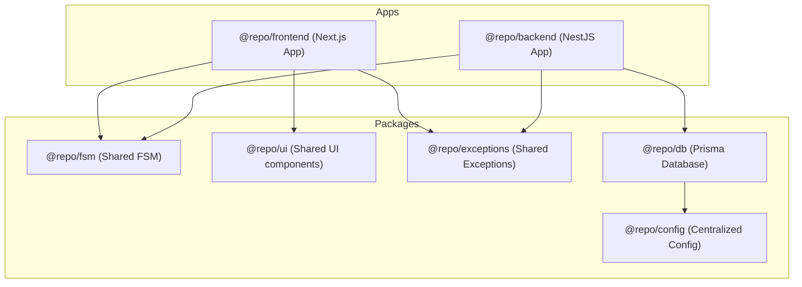
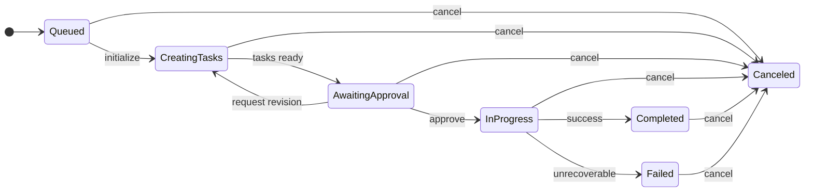
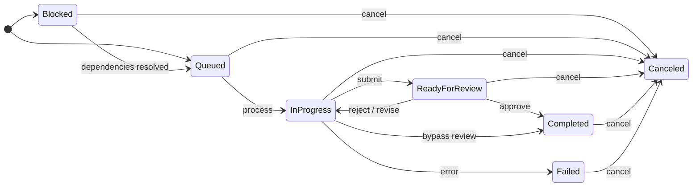

# *EngageLoop* Development Overview & Log

Written & Developed Solely by **Benjamin Levy**  

---

## 1. System Overview

***EngageLoop*** is an open-source project that seeks to develop a means by which users can manage multiple overlapping agents to manage social media engagement. The exposed dashboard allows users to create overarching goals for the orchestra of agents, which are then used to generate subtasks.

### 1.1 User Interface Overview

There will be two major representations with which users may interface. The first-to-be-developed interface will be the more granular, kanban-style table of goals, tasks, and which tasks are assigned to which agents. Users will be able to manipulate goals and tasks (including agent assignments), though these commands will be subject to the [finite state machines](#32-finite-state-machines).

### 1.2 Development Procedure

***EngageLoop*** will be developed in accordance with the general [agile](https://www.atlassian.com/agile) ideologies. This generally means that vertical slice development will be used, building end-to-end features in order of priority and dependency.

---

## 2. System Architecture

### 2.1 Workspace Package Dependencies



### 2.2 Centralized Configuration (`@repo/config`)

All environment-driven configuration is managed through the `@repo/config` package. It uses [Zod](https://zod.dev/) to define and validate a typed schema against `process.env` at startup, ensuring the application fails fast on missing or malformed values. Downstream packages (e.g., `@repo/db`) import the validated `config` object rather than reading `process.env` directly, keeping environment access centralized and type-safe.

### 2.3 Technology Stack

* **Frontend:** Next.JS
* **Backend:** Nest.JS with BullMQ
* **Database:** PostgreSQL
* **LLM Orchestration:** OpenAI-compatible API

---

## 3. Agentic Workflow & State Management

This section outlines the overall procedures guiding the agentic pillar of this application. Once a goal is created, there will be a process by which tasks are created, delegated, and propagated throughout the flow.

### 3.1 Types of Agents

The following types of agents will be used throughout the task lifecycle, each serving a distinct purpose. Some will require tooling to be injected (e.g., to conduct external research). *Note: the order is not fully relevant, as the flow is defined in [finite state machines](#32-finite-state-machines).*

* **Orchestrator**: creates tasks for goals and delegates them to the appropriate agents.
* **Researcher**: researches topics using provided tools (e.g., Puppeteer).
* **Writer**: creates content in accordance with any injected research/additional material. *Note: does not publish any content outside the system.*
* **Reviewer**: prior to any approvals of writing-related tasks, this agent must approve the content by checking for style-, content-, and other-related issues.
* **Engager**: handles responding to comments and other engagement-related events.

### 3.2 Finite State Machines

The finite state machine (FSM) will dictate which states can transition to which states. This FSM will be referenced directly by the API and user interfaces in order to prohibit invalid transitions.

#### 3.2.1 Finite States for Goals

Each goal may take on exactly one of the elements in the set of finite states that follow. *Note: the order is not fully relevant, as the flow is defined directly below this section.*

* **Queued**: the initial state of goals, indicating it has been added to the queue for goals whose tasks are not yet defined.
* **Creating Tasks**: the orchestrator agent creates tasks to accomplish the goal.
* **Awaiting Approval**: the user is prompted to approve/manually revise/request revisions to the created tasks.
* **In Progress**: tasks are being completed by agents. Note that the goal is immutable in this state unless user intervention or errors occur.
* **Completed**: all tasks have been completed successfully.
* **Canceled**: manual intervention has canceled all tasks of this goal.
* **Failed**: any part of the goal flow failed, including any number of tasks that have been deemed unrecoverable.

#### 3.2.2 Finite State Machine for Goals



#### 3.2.3 Finite States for Tasks

Each task may take on exactly one of the elements in the set of finite states that follow.

* **Blocked**: an initial state of a task, indicating its dependencies are not fully resolved. This state may not be used for every task, as some will not have any dependencies.
* **Queued**: an initial and second state of a task, indicating it is waiting in the queue for a worker to pick it up. This state is achieved if the task's dependencies are fully resolved **or** if the task has no dependencies.
* **In Progress**: a task is run using the assigned agent harness (see [types of agents](#31-types-of-agents)).
* **Ready for Review**: the task's creator agent has generated an output payload. The asset is locked, and the reviewer agent evaluates the copy for style, safety, and brand alignment.
* **Completed**: the task has successfully been completed.
* **Canceled**: manual intervention has canceled this task.
* **Failed**: the task experienced an unrecoverable critical error and has ended the task.

#### 3.2.4 Finite State Machine for Tasks



### 3.3 Task Dependency & Failure Recovery Architecture

To prevent pipeline fragmentation and avoid structural complexity within the core Finite State Machines, task dependencies and execution failures are managed via an isolated relational and runtime layer.

#### 3.3.1 Directed Acyclic Graph (DAG) Dependency Logic

When the Orchestrator agent compiles a series of subtasks to achieve an overarching Goal, it does not treat them as a flat sequence. Tasks are organized as a Directed Acyclic Graph (DAG).

* **The Blocked State Gate**: Any downstream task that possesses unresolved prerequisite tasks is initialized with an operational condition of *Blocked*.
* **Queue-Level Promotion**: A task cannot enter the active BullMQ processing line while it remains structurally blocked. The moment all of its parent tasks successfully transition to the **Completed** state, an internal Nest.JS event handler clears the flags, updates the task status to **Queued**, and promotes it into the active worker lane.

#### 3.3.2 Enforced Recovery Vectors

When an active task encounters an unrecoverable exception, a bad LLM parsing layout, or an external social media API failure, the system halts execution and forces one of three deterministic recovery pathways:

1. **Cascade Goal Cancellation**: If a critical milestone task collapses, the system initiates an automated cascade down the graph. It recursively traverses the DAG to find all downstream tasks waiting on that prerequisite, bypassing standard execution to flip them directly into a terminal **Canceled** state. This triggers a macro fallback that trips the overall Goal state straight to **Failed**, safely preventing ghost tasks from running on missing data.
2. **Goal Restart**: If a pipeline failure indicates that the Orchestrator's foundational breakdown was flawed or impossible to execute under current constraints, the system executes a macro rollback. The overall Goal state reverts backward to **Creating Tasks**, wiping out the broken task sequence entirely. The Orchestrator is re-invoked with a modified prompt payload to re-plan and generate a completely fresh set of subtasks.
3. **Human-in-the-Loop Interdiction**: For edge cases where minor environment errors or strict content filters bottleneck a task, the pipeline enters an operational stall. The user can open the specific task card directly on the Next.JS Kanban dashboard and manually input or paste the expected payload or text output. Upon submission, the system marks the task as manually **Completed**, bypassing the worker harness entirely, which cleanly satisfies the DAG conditions and unlocks downstream tasks.

---

## Running the Project

### 1. Prerequisites
Ensure you have Node.js (v18+) and `pnpm` installed.

### 2. Install Dependencies
```bash
pnpm install
```

### 3. Run Development Servers
```bash
pnpm dev
```

### 4. Run E2E tests
```bash
pnpm test
```

### 5. Typecheck all workspaces
```bash
pnpm check-types
```

### 6. Database Management

All database interactions are managed via Prisma in the `@repo/db` package.

* **Generate Prisma Client**:
  ```bash
  pnpm db:generate
  ```
  Runs `prisma generate` to update types for the database client.
* **Run Database Migrations**:
  ```bash
  pnpm db:migrate
  ```
  Runs `prisma migrate dev` to apply schema changes to your database.

#### How to Add/Modify DB Schema

1. Open the schema file at `packages/db/prisma/schema.prisma`.
2. Define or update your models (e.g., `User`).
3. Run the migration script to apply changes and regenerate the client:
   ```bash
   pnpm db:migrate
   ```
4. Prisma client types will auto-update across the workspaces.
