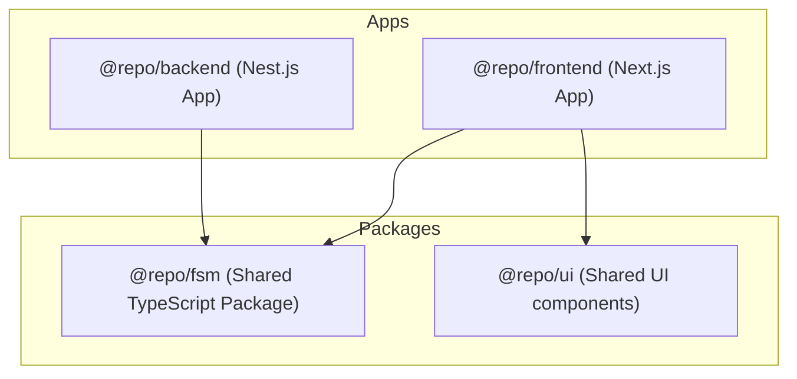

# EngageLoop Monorepo

This monorepo is built using [Turborepo](https://turbo.build/) and is configured with **pnpm workspaces**. It coordinates autonomous agents managing social media engagement using shared finite state machines.

## Architecture & Tech Stack

As outlined in `EngageLoop.pdf`, the system is structured as follows:



1. **Frontend App (`apps/frontend`)**: Next.js app providing a premium dark-themed Kanban dashboard. Users can inspect the active Goal, visual Task Directed Acyclic Graphs (DAG), and test FSM transitions.
2. **Backend App (`apps/backend`)**: NestJS application that acts as the core orchestrator API, managing goal state changes, task DAG dependencies (automatic promotions), and running mock agent harnesses.
3. **Shared Finite State Machine (`packages/fsm`)**: A type-safe state machine library imported by both frontend and backend to govern state transitions for Goals and Tasks.
4. **Shared Component Library (`packages/ui`)**: Predefined UI primitives shared across apps.

---

## State Machines & Recovery Logic

### 1. Goal State Machine
- **States**: `Queued` ➔ `Creating Tasks` ➔ `Awaiting Approval` ➔ `In Progress` ➔ `Completed`
- **Failure/Cancellation**: `Failed`, `Canceled`

### 2. Task State Machine
- **States**: `Blocked` ➔ `Queued` ➔ `In Progress` ➔ `Ready for Review` ➔ `Completed`
- **Failure/Cancellation**: `Failed`, `Canceled`

### 3. Enforced Recovery Vectors (Demonstrated)
1. **Cascade Goal Cancellation**: Failing a task with dependent subtasks recursively cancels downstream tasks and transitions the goal to `FAILED`.
2. **Goal Restart**: Reverts a failed/canceled goal state back to `Creating Tasks`, wiping the broken task sequence and generating a fresh set of subtasks.
3. **Human-in-the-Loop (HITL) Interdiction**: Allows direct manual input override to force a blocked, failed, or canceled task to `COMPLETED`, satisfying DAG prerequisites and promoting downstream tasks to `Queued`.

---

## Running the Project

### 1. Prerequisites
Ensure you have Node.js (v18+) and `pnpm` installed.

### 2. Install Dependencies
Run from the root directory:
```bash
pnpm install
```

### 3. Run Development Servers
Start both the NestJS API server (running on `http://localhost:4000`) and the Next.js Frontend server (running on `http://localhost:3000`):
```bash
pnpm dev
```

### 4. Build and Compile checks
Ensure full TypeScript compilation and builds are clean:
```bash
pnpm check-types
pnpm build
```
